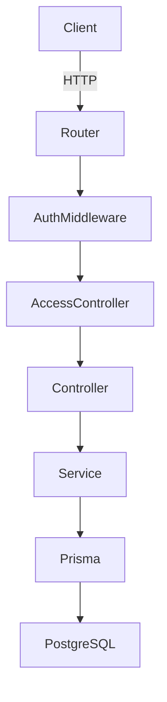

# Design Document: Finance Backend

## Overview

A RESTful backend API built with Node.js (TypeScript) and Express, backed by a PostgreSQL database via Prisma ORM. The system supports financial record management, user role-based access control, and aggregated dashboard analytics. Authentication is handled via JWT tokens.

**Technology choices:**
- Runtime: Node.js with TypeScript
- Framework: Express.js
- Database: PostgreSQL (SQLite acceptable for local dev)
- ORM: Prisma
- Auth: JWT (jsonwebtoken)
- Validation: Zod
- Password hashing: bcrypt
- Property-based testing: fast-check
- Unit/integration testing: Vitest

## Architecture



Request flow:
1. Router matches the route
2. AuthMiddleware validates the JWT and attaches the user to the request
3. AccessController checks the user's role against the required permission
4. Controller parses and validates the request body via Zod schemas
5. Service executes business logic and calls Prisma
6. Prisma queries PostgreSQL and returns results

## Components and Interfaces

### Router Layer
- `src/routes/auth.routes.ts` — POST /auth/login
- `src/routes/users.routes.ts` — CRUD for /users
- `src/routes/records.routes.ts` — CRUD + filter for /records
- `src/routes/dashboard.routes.ts` — GET /dashboard/summary, /category, /trends, /recent

### Middleware
- `src/middleware/auth.middleware.ts` — Verifies JWT, attaches `req.user`
- `src/middleware/rbac.middleware.ts` — Factory function `requireRole(...roles)` that returns a middleware checking `req.user.role`

### Controllers
- `src/controllers/auth.controller.ts`
- `src/controllers/users.controller.ts`
- `src/controllers/records.controller.ts`
- `src/controllers/dashboard.controller.ts`

### Services
- `src/services/auth.service.ts` — login, token generation
- `src/services/users.service.ts` — create, list, update user
- `src/services/records.service.ts` — CRUD, filter, soft delete
- `src/services/dashboard.service.ts` — aggregation queries

### Validation Schemas
- `src/schemas/user.schema.ts` — Zod schemas for user creation/update
- `src/schemas/record.schema.ts` — Zod schemas for record creation/update/filter
- `src/schemas/auth.schema.ts` — Zod schema for login

### Error Handling
- `src/middleware/error.middleware.ts` — Global error handler
- `src/errors/AppError.ts` — Custom error class with statusCode and type

## Data Models

### User
```prisma
model User {
  id         String   @id @default(uuid())
  name       String
  email      String   @unique
  password   String   // bcrypt hash
  role       Role     @default(VIEWER)
  status     Status   @default(ACTIVE)
  createdAt  DateTime @default(now())
  updatedAt  DateTime @updatedAt
  records    FinancialRecord[]
}

enum Role {
  VIEWER
  ANALYST
  ADMIN
}

enum Status {
  ACTIVE
  INACTIVE
}
```

### FinancialRecord
```prisma
model FinancialRecord {
  id          String    @id @default(uuid())
  amount      Decimal
  type        RecordType
  category    String
  date        DateTime
  notes       String?
  deletedAt   DateTime?  // soft delete
  createdAt   DateTime   @default(now())
  updatedAt   DateTime   @updatedAt
  createdBy   User       @relation(fields: [createdById], references: [id])
  createdById String
}

enum RecordType {
  INCOME
  EXPENSE
}
```

### API Response Shape

Success:
```json
{ "data": { ... }, "meta": { "page": 1, "total": 100 } }
```

Error:
```json
{ "status": 400, "error": "VALIDATION_ERROR", "message": "amount must be a positive number" }
```

## Correctness Properties

*A property is a characteristic or behavior that should hold true across all valid executions of a system — essentially, a formal statement about what the system should do. Properties serve as the bridge between human-readable specifications and machine-verifiable correctness guarantees.*

---

Property 1: User creation round trip
*For any* valid user creation payload, creating a user and then fetching that user by ID should return an object with matching name, email, and role — and no password field.
**Validates: Requirements 1.1, 7.3**

---

Property 2: Inactive user blocks login
*For any* user whose status is set to INACTIVE, a login attempt with correct credentials should return a 401 Unauthorized response.
**Validates: Requirements 1.5, 2.5**

---

Property 3: Invalid credentials return 401
*For any* login request where the password does not match the stored hash for the given email, the system should return a 401 Unauthorized response.
**Validates: Requirements 2.2**

---

Property 4: Unauthenticated requests are rejected
*For any* protected endpoint, a request made without a valid Auth_Token should return a 401 Unauthorized response.
**Validates: Requirements 2.3, 4.5**

---

Property 5: Role-based write access — Viewer is read-only
*For any* write operation (POST, PATCH, DELETE) on /records or /users, a request authenticated as a Viewer role should return a 403 Forbidden response.
**Validates: Requirements 1.6, 3.6, 5.1**

---

Property 6: Role-based access — Analyst cannot manage users
*For any* request to create, update, or delete a user, a request authenticated as an Analyst role should return a 403 Forbidden response.
**Validates: Requirements 5.2**

---

Property 7: Record creation round trip
*For any* valid financial record payload, creating a record and then fetching it by ID should return an object with matching amount, type, category, and date.
**Validates: Requirements 3.1**

---

Property 8: Filter correctness
*For any* set of financial records and any combination of filter parameters (date range, category, type), all records returned by the list endpoint should satisfy every provided filter criterion.
**Validates: Requirements 3.3**

---

Property 9: Soft delete excludes from listing
*For any* financial record that has been soft-deleted, subsequent calls to the list endpoint should not include that record in the results.
**Validates: Requirements 3.5, 7.2**

---

Property 10: Summary totals correctness
*For any* set of non-deleted financial records, the summary endpoint should return total_income equal to the sum of all INCOME records, total_expenses equal to the sum of all EXPENSE records, and net_balance equal to total_income minus total_expenses.
**Validates: Requirements 4.1**

---

Property 11: Category totals correctness
*For any* set of non-deleted financial records, the category summary endpoint should return totals where each category's total equals the sum of amounts for records in that category.
**Validates: Requirements 4.2**

---

Property 12: Recent activity ordering
*For any* set of non-deleted financial records, the recent activity endpoint should return records sorted by date in descending order.
**Validates: Requirements 4.4**

---

Property 13: Error response structure invariant
*For any* request that results in an error (4xx or 5xx), the response body should always contain the fields: status (number), error (string), and message (string).
**Validates: Requirements 6.5**

---

Property 14: Missing required fields return 400
*For any* request body that omits one or more required fields, the Validator should return a 400 Bad Request response that names the missing fields.
**Validates: Requirements 6.1**

---

Property 15: Password never exposed
*For any* API response (user creation, user listing, user fetch, login), the response body should never contain a password field.
**Validates: Requirements 7.3**

---

Property 16: Data persistence round trip
*For any* user or financial record created via the API, querying the database directly after creation should return a row with matching data.
**Validates: Requirements 7.1, 7.4**

---

## Error Handling

All errors are routed through the global error middleware (`error.middleware.ts`).

- `AppError` is thrown by services/controllers with a `statusCode` and `type` string
- Zod validation errors are caught and transformed to 400 responses listing field errors
- Prisma unique constraint violations are caught and mapped to 409 responses
- Prisma not-found errors are caught and mapped to 404 responses
- Unhandled errors return 500 without stack trace details in production

Error type constants:
- `VALIDATION_ERROR` — 400
- `UNAUTHORIZED` — 401
- `FORBIDDEN` — 403
- `NOT_FOUND` — 404
- `CONFLICT` — 409
- `INTERNAL_ERROR` — 500

## Testing Strategy

### Dual Testing Approach

Both unit tests and property-based tests are used. They are complementary:
- Unit tests verify specific examples, edge cases, and error conditions
- Property-based tests verify universal properties hold across many generated inputs

### Unit Tests (Vitest)
- Service layer functions tested in isolation with a test database
- Controller layer tested via supertest HTTP calls
- Edge cases: duplicate email, inactive user login, missing fields, negative amounts, invalid dates
- Each test file co-located with source: `*.test.ts`

### Property-Based Tests (fast-check)
- Library: `fast-check` (npm package)
- Minimum 100 iterations per property test
- Each property test references its design document property number
- Tag format in test comments: `// Feature: finance-backend, Property N: <property text>`
- Each correctness property above is implemented by exactly one property-based test

**Property test file locations:**
- `src/services/__tests__/users.property.test.ts` — Properties 1, 2, 3, 15
- `src/services/__tests__/auth.property.test.ts` — Properties 4
- `src/middleware/__tests__/rbac.property.test.ts` — Properties 5, 6
- `src/services/__tests__/records.property.test.ts` — Properties 7, 8, 9
- `src/services/__tests__/dashboard.property.test.ts` — Properties 10, 11, 12
- `src/middleware/__tests__/error.property.test.ts` — Properties 13, 14
- `src/services/__tests__/persistence.property.test.ts` — Property 16

### Test Database
- A separate test PostgreSQL database (or SQLite in-memory via Prisma) is used for all tests
- Each test suite resets relevant tables before running
